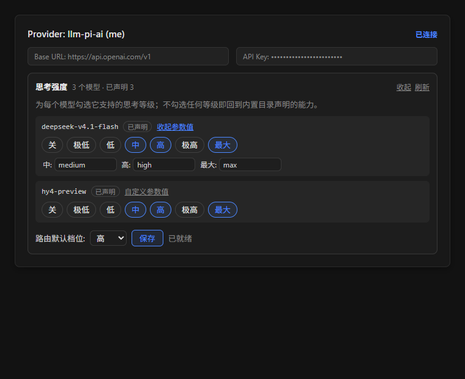

<div align="center">

# DSH Thinking Effort

**DeepSeek Harness (DSH Desktop) 客户端插件**<br>
在「设置 → Models」的提供商卡片中，为路由与每个模型配置 **思考强度 (Reasoning Effort)**

`@dsh-external/dsh-thinking-effort`

<p align="center">
  <a href="#特性与亮点"></a>
  <a href="#测试与可复现验证"></a>
  <a href="#许可与协议"></a>
  <a href="package.json"></a>
</p>

</div>

---

## 概述

**dsh-thinking-effort** 是专为 **DSH Desktop** 打造的前端扩展插件。

宿主现有的模型设置页（`@deepseek-ai/dsh-client-ui-settings-models`）提供了「上下文窗口」、「最大输出」与「输入类型」的编辑界面，而底层适配器（如 `llm-pi-ai`、`llm-deepseek`）虽已内置支持思考强度或推理模式 schema，界面上却未暴露可视化配置入口。

本插件利用宿主提供的 `settings.models.provider-card` 插槽，无缝内嵌到「设置 → Models」的每一张提供商卡片中（包括既有卡片、初次设置卡与添加草稿卡），以最小改动原则为每个模型和提供商路由声明思考强度。

<p align="center">
  
</p>

---

## 特性与亮点

- 🎯 **原生级视觉融合**：注入于提供商配置卡片，与官方「上下文」、「输入类型」配置流程保持一致。
- 📦 **轻量折叠设计**：默认紧凑收起，展示摘要（如模型数/已配置数、路由当前档位）；展开后即呈现直观的控制面板。
- 🔀 **自适应双适配器架构**：
  - **`llm-pi-ai`（模型级精细控制）**：
    - 支持 7 个标准思考等级：`关 (off)` / `极低 (minimal)` / `低 (low)` / `中 (medium)` / `高 (high)` / `极高 (xhigh)` / `最大 (max)`。
    - 状态三态可视化：**继承目录**、**非推理模型 (`false`)**、**已自定义声明**。
    - 支持「路由级默认档位」（`reasoning`）下拉设置。
    - **自定义参数值**：针对非标准上游接口，提供次要「自定义参数值」展开项，允许自由映射各档位对应的 wire 协议拼写（留空自动使用档位名）。
  - **`llm-deepseek`（路由级联动）**：
    - 针对 DeepSeek 适配器特性，提供路由级共享的 `thinking`（`enabled` / `disabled`）与 4 档 `reasoningEffort`（`off` / `low` / `high` / `max`）。
    - 严格遵循宿主内核联动约束（`thinking` 关闭时自动回退并锁定为 `off`）。
- 🛡️ **安全的写入策略（防踩坑与防膨胀）**：
  - **精准 diff**：仅修改被操作的字段与模型，绝不污染或重置卡片内其他已有项。
  - **数组下标安全检查**：在用户层存在同长 `models` 数组时采用精准下标更新，否则自动退化为整数组替换写入，避免触发宿主配置系统越界异常。
  - **保护 DeepSeek 默认目录**：绝不向 DeepSeek `models` 写入模型级推理字段，防止将内置 2 条 catalog 静态物化至用户层而失去跟随内核升级的能力。
  - **空选择还原**：取消勾选所有档位时自动产生 `unset` 操作，干净回落到内置目录能力，而不是保存非法空对象 `{}`。
- 🧪 **高标准严苛测试**：内附 4 套完整规格测试，涵盖独立外部测试、真实模块加载验证与端到端面板行为测试，共 **193 项断言** 全数通过。

---

## 机制与插槽

本插件挂载于宿主模型页唯一的卡片级插槽：
- **插槽名称**：`settings.models.provider-card`
- **类型**：`kind: "keyed"`，`scope: "root"`
- **派发规则**：按提供商的 `settingsNs` 作为 key 派发给对应的已保存卡片、初次设置卡片与新增草稿卡片。
- **数据通道**：
  - 读：`ctx.remote.settings.describe()`
  - 写：`ctx.remote.settings.mutate(ns, ops, expectedRevision)`

---

## 安装与使用

### 方式 A：手动配置（推荐，透明可控）

1. 打开 DSH 桌面配置文件的 `package.json`（通常位于 `~/.dsh/profiles/desktop/package.json`）：
   - 在 `dsh.profile.bundles` 数组中追加：
     ```json
     "@dsh-external/dsh-thinking-effort"
     ```
   - 在 `dependencies` 对象中追加本地路径映射：
     ```json
     "@dsh-external/dsh-thinking-effort": "link:C:/Code/DSH_Desktop/dsh-thinking-effort"
     ```
2. 在该 profile 目录下执行依赖安装：
   ```bash
   pnpm install
   # 或使用 DSH 运行时自带的 node 执行：
   # node <DSH安装目录>/resources/payload/dependencies/pnpm/bin/pnpm.mjs install
   ```
3. **完全退出并重启 DSH Desktop**（新插件作为 bundle 加入需要冷启动加载）。

> ⚠️ **互斥提示**：本插件已配置 bundle 补丁（`cordis.patch.yml`，声明 loader 行 id `thinking-effort`）。将其列入 `bundles` 即可自动生效，**切勿**在用户层 `cordis.patch.yml` 手动追加同名 `thinking-effort` 行，否则内核会抛出 `duplicate loader entry id` 导致加载失败。

### 方式 B：GUI 插件管理器
插件已内置合法的 `dsh.bundle.patch`，满足 DSH 插件管理器各项安全校验，可直接通过桌面端插件安装面板导入安装。

### 卸载
1. 从 profile 的 `package.json` 中移除 `dsh.profile.bundles` 与 `dependencies` 中的对应声明。
2. 重新执行 `pnpm install`。
3. 重启 DSH Desktop。

---

## 测试与可复现验证

项目采用纯真实宿主模块及契约进行自证，无需伪造替身。

在项目根目录下执行：
```bash
node tests/run-all.mjs
```

执行结果：
```text
===== independent.spec.mjs =====
全部 87 项通过

===== loadpath.spec.mjs =====
全部 11 项通过

===== packaging.spec.mjs =====
全部 19 项通过

===== panel.spec.mjs =====
全部 76 项通过

===== 汇总 =====
4 个脚本，4 通过，0 失败（共 193 项断言全数通过）
```

### 测试环境变量配置
可按需覆盖各验证链条的引用基准：

| 环境变量 | 默认值 | 说明 |
|---|---|---|
| `DSH_REF_DIR` | `../_effref` | 运行中 `app.asar` 提取物（0.1.7-rc.2），提供真实 `applyPathOp` 源码切片 |
| `DSH_FULL_NM` | `../_staging/dsh-full/dsh/node_modules` | 完整依赖树（0.1.7-rc.1），提供适配器模块导入 |
| `DSH_ASAR` | `C:/App/DeepSeek Harness/resources/app.asar` | 宿主核心 asar 路径，用于版本一致性自证 |
| `DSH_TE_PROFILE_DIR` | `~/.dsh/profiles/desktop` | 被测 profile 目录（注意：请勿使用被系统占用的 `DSH_PROFILE`） |

---

## 限制与注意事项

1. **面板式集成**：受限于宿主插槽设计（仅提供卡片级 `provider-card` 插槽，未提供模型行级别行内插槽），思考强度采用卡片内折叠面板呈现，而非完全内联在官方每一行输入框中。
2. **草稿与自定义卡片分派限制**：在「添加提供商」草稿卡片尚未添加目录行（`addRow === undefined`）或使用手动 `CustomProviderCard` 分支时，宿主不会派发该插槽。
3. **DeepSeek 模型级字段限制**：DeepSeek 官方适配器的 `catalogModel` 在语义层无模型级推理字段，仅支持全路由共享档位；对 DeepSeek 写入模型级字段虽能通过通用 schema，但会被底层逻辑丢弃。插件对此做了主动隔离与保护。
4. **自定义参数值适用场景**：绝大多数标准兼容服务无需填写「自定义参数值」，仅当上游中转/聚合网关使用非标准思考等级名称时才需配置。

---

## 许可与协议

- **作者**：[otae-1204](https://github.com/otae-1204)
- **工程与验证协作**：DeepSeek
- **许可证**：本项目采用 [MIT License](LICENSE) 授权开源。
